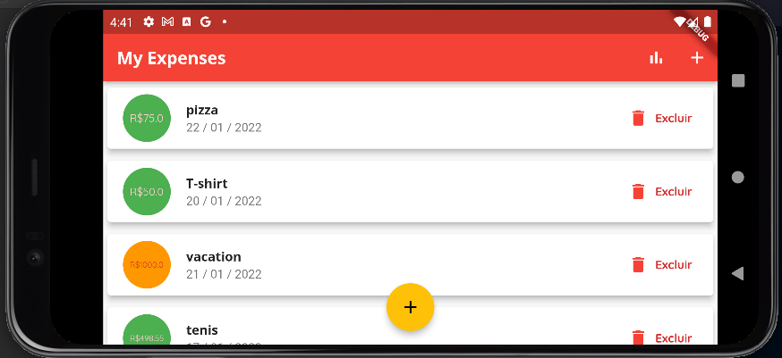

This is my first more complex project on Flutter.
The project was proposed in the course: Learn Flutter and Develop Apps For Android and IOS 2021 -
A Complete Course to Learn Google Flutter and Dart for Building Native Apps for iOS and Android.
This course was created by Leonardo Moura Leitao and Maximilian Schwarzmüller.
It is available on Udemy at https://www.udemy.com/course/curso-flutter/

# udemy_expenses

A new Flutter project.
The purpose of this project is to create an expense manager. With a form for registering expenses, a list of registered expenses and a bar chart that shows the percentage of expenses per day of the week.

See the screens and features below:

**Empty home screen:**

_Landscape mode_

---

**Form to register expenses**

---

**Some expenses registered...**

_list icon: to view the list in landscape_

_chart icon: to view the chart in landscape_

---

For help getting started with Flutter, view our
[online documentation](https://flutter.dev/docs), which offers tutorials,
samples, guidance on mobile development, and a full API reference.
